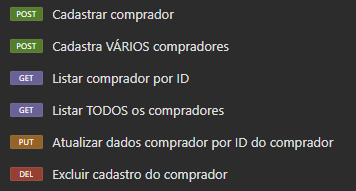
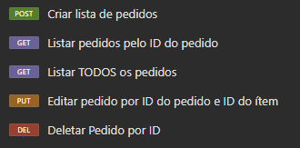

<h1 align='center'>Desafio API REST:</h1>

<h3>Objetivos:</h3>

  
 <b>1 - Clonar o repositório: ✅ </b> 

   
  Através desse repositório, faça as próximas etapas do desafio: 

* https://github.com/guimendes92/cardinalidade

--------------------------------------------------

  
 <b>2 - Povoar o projeto com dados de clientes para conseguir fazer as requisições; ✅</b> 

   

* Já existe o método para criar clientes, basta criar uma requisição com os parâmetros necessários para preencher os campor da tabela;

--------------------------------------------------

  
 <b>3 - Utilizar o código para promover a adição de um método que fará a busca única de clientes através do parâmetro ID; ✅</b> 

   

* Atualmente é possível verificar as pessoas cadastradas, porém, isso gera um json com a lista de TODOS os compradores, o objetivo é buscar um comprador específico através de sua identificação única ID;

--------------------------------------------------

  
 <b>4 - Criar métodos que utilizem dos verbos GET, POST, PUT e DELETE para ler, criar, editar e excluir pedidos realizados pelos clientes; 👨‍💻</b> 

   

Esse método precisa:

* Criar um método que adiciona novos pedidos (lembrando que cada pedido pode ter um ou vários ítens inclusos) <b>(POST)</b>; ✅ 🤯
* Listar TODOS os pedidos realizados pelo cliente <b>(GET)</b>; ✅ 😀
* Listar pedidos específicos através do ID da compra <b>(GET por ID)</b>; ✅ 😀
* Permitir que os ítens dos pedidos possam ser atualizados mesmo após eles terem sido concluídos <b>(PUT)</b>; ✅ 🙂
* Excluir pedidos específicos através do ID da compra <b>(DELETE por ID)</b>; ✅ 😀
<!--* Excluir todos os pedidos realizados <b>(DELETE)</b>; 🕒-->

<b>Outros métodos testados:</b> 

* Cadastro de vários compradores simultâneamente, para facilitar na hora de fazer os testes <b>(POST)</b>; ✅ 🙂
* Editar o cadastro dos compradores através do ID do comprador <b>(PUT por ID)</b>; ✅ 😀
* Excluir o cadastro dos compradores através do ID do comprador <b>(DELETE por ID)</b>; ✅ 😀
* Listar todos os ítens que foram vendidos (nesse caso, somente os dados dos ítens são listados, sem relação com um número de pedido ou cliente) <b>(GET)</b>; ✅ 😀

 

--------------------------------------------------

  
 <b>5 - Subir o projeto no GitHub! ✅</b> 

   

* Deixar o projeto com visibilidade pública e ir comitando as alterações! ✅

--------------------------------------------------

 <h1 align='center'>Anotações:</h1>

  
 <b>Legenda dos ícones: 🗺️</b> 

 
 
* ✅ -> Finalizado
* 👨‍💻 -> Em progresso
* 🕒 -> Não iniciado
* 😀 -> baixa dificuldade
* 🙂 -> media dificuldade
* 🤯 -> alta dificuldade
 

 

  
 <b>Informações do projeto: ℹ️</b> 

 

 
    
 <b>Acesso as tabelas: 🛢️</b> 

   
  Para acessar as tabelas do projeto, após iniciá-lo, acesse o link abaixo e clique em connect:

   

    http://localhost:8080/h2-console/login.jsp?jsessionid=ed19cebe9f228d63816f9185f0931375

Isso é necessário porque o projeto foi desenvolvido de forma simples, com o objetivo de ser iniciado facilmente, sem a necessidade de uma estrutura MySQL local na máquina do usuário.

  --------------------------------------------------

  
 
    
 <b>Povoando as tabelas para realizar os testes: 📊</b> 

     
    Para testar os métodos disponíveis na aplicação, primeiro, é preciso adicionar dados a ela. Esses dados são referentes ao cadastro de clientes e criação de um pedido, e para fazermos as requisições de        criação de pedidos e cadastramento de compradores, por exemplo, aconselho que seja utilizado o Insomnia ou Postman, mas, tranquilarmente é possível utilizar outras ferramentas disponíveis! :) 

   

--------------------------------------------------

  
 
    
 <b>Cadastrando clientes: 👥</b> 

Para cadastramos um cliente na nossa aplicação, temos o seguinte modelo de JSON para ser lançado:

   

    POST -> http://localhost:8080/comprador/cadastro

    {
    	"nome" : "Ada",
    	"sobrenome" : "Wong",
    	"idade" : "28"
    }

Esse modelo acima, adiciona os clientes de forma unitária (um por vez), mas, caso queira cadastrar vários compradores, pode ser utilizado esse modelo de JSON:

    POST -> http://localhost:8080/comprador/cadastro/massa/testes

    [
        {
            "nome" : "Heather",
            "sobrenome" : "Mason",
            "idade" : "20"
        },
        {
            "nome" : "Leon",
            "sobrenome" : "Scott Kennedy",
            "idade" : "30"
        },
        {
            "nome" : "Ada",
            "sobrenome" : "Wong",
            "idade" : "28"
        }
    ]

  

--------------------------------------------------

   
 
    
 <b>Listando TODOS os clientes cadastrados: 📋</b> 

Para verificarmos todos os clientes cadastrados na nossa aplicação, utilize o comando abaixo:
 

    GET -> http://localhost:8080/comprador/listar/compradores

Essa listagem dos compradores adicionados, pode também ser realizadas por consultas diretas na nossa tabela, com o seguinte comando:

    SELECT * FROM comprador

  

 

<b>Mapa de verbos para as requisições de cadastrar comprador:</b>

  

 

<b>Criando um pedido:</b>

Para criar um pedido, é importante que já tenhamos no mínimo um comprador cadastrado, para conseguir atrelá-lo a compra. <b>No início de nosso JSON, temos "comprador" {id}, nesse id, deve ser adicionado o número de id do cliente que queremos atrelar ao pedido, nesse exemplo, será o cliente de id = 2</b>.

    {
        "comprador": {
        "id": 2
        },
        "listaDeItens": [
            {
                "descricao": "Figuras Studios Ghibli Hauru, Totoro, Catbus e Outros",
                "valor": 189.90
            },
            {
                "descricao": "DVD Anime Violet Evergarden 1ª Temporada",
                "valor": 29.90
            },
            {
                "descricao": "Blu-ray Túmulo dos Vaga-lumes - Filme Ghibli 1988 em alta definição.",
                "valor": 29.90
            }
        ]
    }

 

Atualizando um ítem do pedido: 

Para atualizar um ítem do pedido, usamos o PUT, e ele editará a descrição e/ou valor de um dos nossos ítens declarados.

Em exemplo, no tópico "Criando um pedido" temos um JSON com 3 ítens adquiridos pelo comprador de id 1.

Vamos supor que eu queira editar o terceiro ítem que tem os seguintes dados:

    {
        "descricao": "Blu-ray Túmulo dos Vaga-lumes - Filme Ghibli 1988 em alta definição.",
        "valor": 29.90
    }

Por este aqui:

    {
        "descricao": "DVD Blu-ray Crianças Lobo (Wolf Children) - Preço promocional!",
        "valor": 20.90
    }
    
Para isso, precisaríamos de 2 informações:

* <b>'ID' do PEDIDO</b>
* <b>'ID' do ÍTEM</b>

Vamos pressupor que o 'ID' do PEDIDO seja = 1 e o 'ID' do ÍTEM que desejamos alterar, seja = 3. Nessas condições, a nossa requisição ficaria assim:

    PUT -> http://localhost:8080/pedidos/1/itens/3

E o nosso JSON seria o mesmo que vimos acima, contendo os novos dados:
    
    {
        "descricao": "DVD Blu-ray Crianças Lobo (Wolf Children) - Preço promocional!",
        "valor": 20.90
    }

Dessa forma, os outros ítens do nosso pedido ficariam intactos, e somente um em específico seria alterado.

 

<b>Excluir um pedido pelo ID:</b>

Para excluirmos um pedido da nossa base de dados, precisamos de um dado, o 'ID' do pedido. 

Na nossa requisição, precisaremos somente passar o 'ID' do pedido que queremos excluir, e ele será totalmente apagado da nossa aplicação.

O corpo da requisição ficaria assim:

    DELETE -> http://localhost:8080/pedidos/1

Nesse exemplo, estamos a abrir uma requisição para que o pedido de 'id' = 1 seja excluído.
 

<b>Vale lembrar que, uma vez excluído, o pedido não poderá mais ser recuperado!</b>

 

<b>Mapa de verbos para as requisições de PEDIDOS</b>

 

 

 

   
<b>Ideias futuras: 💭</b>

    

     
Cadastro de endereço de clientes facilitado: 

     
   
Temos a tabela de "endereço" e "cidade", que devem conter os dados de endereço dos compradores. O objetivo é, conectar a aplicação com a API do ViaCEP, de forma que baste somente adicionar o CEP,          complemento e número da casa para termos os dados de endereço dos clientes preenchidos.

   
   
A utilização da API ViaCEP facilitaria o trabalho de cadastro dos endereços, visto que dados como:

  
     * nome da rua
     * município
     * cidade
     * bairro

   
Já seriam automaticamente preenchidos, diminuindo as chances de adicionar um endereço inexistente e trazendo uma maior facilidade no cadastro.

   
Informações sobre a API ViaCEP: 

     https://viacep.com.br/
    
   

   
 

<!--  -->
